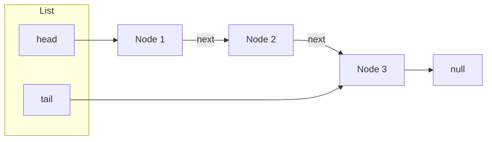

# Linked List benchmark findings (methodology & summary)

This document covers: **Linked List** benchmark result comparison across Python, Java, C++, and Rust; **methodology** (warm-up, 5 runs, mean ± std, memory measurement); **complexity** (Big O for insert, traverse, delete); and **pitfalls** (e.g. using `get(i)` in a loop, stack overflow). See [methodology.md](../../docs/methodology.md) for full definitions. Results below come from `raw/*_linked_list.csv` in this folder; plots are in `plots/`.

---

## Complexity (Big O) and benchmark design

All implementations are **singly-linked lists** with a head and tail pointer (where applicable). The benchmark measures operations that match typical usage and avoid hidden cost traps.

| Operation | Big O | Notes |
|-----------|--------|--------|
| **Insert (push_back)** | O(1) | With tail pointer, append is constant time per element. |
| **Get (traverse)** | O(n) | Full scan: follow pointers from head to end. The benchmark times **sequential traversal** (e.g. `traverse(f)`), not random access by index. |
| **Delete** | O(n) for last (or arbitrary index) | Deleting at index `i` requires finding the **predecessor** of the node at `i`. With a singly-linked list there is no O(1) way to get the predecessor of the tail; we must traverse from head. So delete-at-end is O(n). Delete at head is O(1). |

**Why we do not time `get(i)` in a loop:**

- **O(n²) cost:** Each `get(i)` walks from the head to index `i`, so a loop `for i in 0..n { get(i) }` does 0 + 1 + 2 + … + (n−1) = **Θ(n²)** pointer traversals. At large n this dominates and can make the benchmark appear to hang (e.g. at n = 1_000_000).
- **Stack overflow risk:** In languages or implementations where traversal or indexing is **recursive** (e.g. recursive `get(index)` or recursive visit), a single full scan over a long list can blow the call stack. Even when iterative, a **loop of get(i)** is both slow and a common mistake; the benchmark avoids it by measuring **one** O(n) traverse instead.

So the reported “get” time is the cost of **one full sequential traversal**, which is the right way to “read every element” on a linked list.

---

# Findings: Linked List benchmark comparison

Summary of results from `raw/*_linked_list.csv` (scaled N, warm-up, mean ± std over 5 runs). All four implementations are **singly-linked lists** (custom code). Data from current `raw/` CSVs; plots in `plots/`.

---

## Numbers at a glance (N = 1,000,000)

| Language | Insert (ms) | Get / traverse (ms) | Delete (ms) | Memory (MB) |
|----------|-------------|----------------------|-------------|-------------|
| C++      | 8.82 ± 0.13 | 3.62 ± 0.21         | 3.32 ± 0.04 | 37.9        |
| Rust     | 10.38 ± 0.84| 2.99 ± 0.97         | 4.08 ± 0.94 | 36.3        |
| Java     | 19.59 ± 7.83| 8.44 ± 12.35        | 1.51 ± 0.26 | 90.6        |
| Python   | 540.63 ± 4.19 | 121.85 ± 2.15    | 18.45 ± 0.51 | 98.3       |

---

## Summary of test results

- **Scaled N:** Insert, traverse, and delete all scale with N. C++ and Rust are fastest on insert and get (C++ ~8.8 ms insert, ~3.6 ms get at 1M; Rust ~10.4 ms insert, ~3.0 ms get at 1M). Rust uses slightly less memory than C++ at 1M (36.3 vs 37.9 MB). Python is slowest (540 ms insert, 122 ms get at 1M). Java sits between native and Python on time but with **high variance** and **non-linear scaling** across N (see below). See `plots/`: linked-list_insert_log.png, linked-list_get_log.png, linked-list_delete_log.png, linked-list_memory_log.png.

---

## Memory layout (optional)

A small diagram and per-language layout sketch can help visualize why pointer and object overhead differ across languages.

**Linked chain (all languages):** each node holds a value and a pointer/reference to the next node; the list holds a head (and in our impl, a tail) pointer.

**Per-node memory layout (conceptual):** the payload is one `int`; the rest is pointer/reference and language-specific object overhead. *Sizes below are approximate and from language/runtime conventions (64-bit), not measured in this project.*

| Language | Per-node layout (conceptual) | Pointer/reference | Object overhead |
|----------|------------------------------|-------------------|------------------|
| **C++**  | `[ value (4B) \| next* (8B) ]` | 8B pointer        | None (plain struct) |
| **Rust** | `[ value (4B) \| next (8B) ]`  | 8B (Box)          | None (struct) |
| **Java** | `[ object header (12B) \| value (4B) \| next (8B) ]` | 8B reference | ~12B header (mark, class ptr) |
| **Python** | `[ PyObject header (~56B) \| value \| next ]` | 8B reference | ~56B+ (refcount, type, dict, etc.) |

So for 1M nodes, C++/Rust sit near the minimum (value + one pointer per node), while Java adds a fixed header per object and Python adds a large PyObject header per node—which matches the higher reported memory for Java and Python at 1M in the table above.

---

## Expected vs unexpected behaviors

**Expected (with data):**

1. **C++/Rust fastest:** AOT-compiled, no GC; per-node allocation and pointer chasing still favor native code. Insert ~8–10 ms, get ~3–3.6 ms at 1M.
2. **Python slowest:** Interpreter and per-node object overhead. Insert 540 ms, get 122 ms at 1M.
3. **Delete is costly:** Delete (at end or by index) requires traversing to the predecessor, so it is O(n) and comparable in time to a full traverse (e.g. C++ delete 3.32 ms vs get 3.62 ms at 1M).

**Unexpected or notable:**

1. **Java non-linear performance across N:** Java timings do not scale linearly with N like C++ and Rust. For example, get (traverse) at 10K is ~0.42 ms and at 100K is ~0.51 ms (only ~1.2× for 10× more elements), then jumps to ~8.44 ms at 1M. Insert similarly: 10K→100K is ~5.7×, 100K→1M is ~5.4×. High variance (e.g. get at 1M: 8.44 ± 12.35 ms) suggests **JIT warm-up, GC, or allocation behavior** that differs by scale. So Java linked-list performance is **less predictable and less linear** than C++/Rust across the same N range.
2. **Rust get slightly faster than C++ at 1M** (2.99 vs 3.62 ms) in this snapshot; both are in the same ballpark and sensitive to allocator and layout.

---

## Possible explanations (with data)

- **C++/Rust:** Tight loops, no GC pauses, cache effects dominate pointer-chasing cost. Insert/delete/get at 1M all in the 3–10 ms range (raw/*_linked_list.csv).
- **Java:** JIT and GC interact with many small allocations (one per node). Scaling and variance (e.g. get_std 12.35 ms at 1M) indicate **non-linear and environment-dependent** behavior compared to AOT-compiled languages.
- **Python:** Per-node Python objects and interpreter overhead; linked lists are a poor fit for high-throughput, large-N workloads in Python.

---

## Interpretation

### C++ and Rust: fastest and predictable

C++ and Rust are **fastest and scale roughly linearly** with N:

- **Singly-linked list:** O(1) push_back with tail; O(n) traverse and O(n) delete (traverse to predecessor).
- **No GC:** Avoids pauses and variance from collection during the timed runs.
- **Memory:** Rust ~36.3 MB, C++ ~37.9 MB at 1M (similar; both reflect process/heap for ~1M nodes).

---

### Java: non-linear scaling and high variance

Java is **between native and Python on time** but shows **non-linear scaling and high variance**:

- **Get (traverse):** 10K→100K barely increases (0.42 → 0.51 ms), then 100K→1M jumps to 8.44 ms. This suggests JIT or memory effects that change with scale.
- **High standard deviation:** e.g. get 8.44 ± 12.35 ms at 1M — std larger than mean. GC and allocation patterns likely contribute.
- **Delete:** Reported 1.51 ms at 1M (faster than C++/Rust in this run); again, variance and GC can make single-run comparisons misleading.

For **managed, portable code**, Java linked lists are usable but **less predictable** than C++/Rust across different N.

---

### Python: orders of magnitude slower

Python is **~50–60× slower than C++/Rust on insert** and **~40× on get** at 1M:

- Each node is a Python object; traversal and insertion pay full interpreter and allocation cost.
- Linked lists in Python are suitable for **correctness and small N**; for large N and throughput, arrays or compiled extensions are preferable.

---

## Pitfalls and limitations

- **Do not use `get(i)` in a loop to “iterate” the list:** That is O(n²) and can make benchmarks appear to hang at large n. Use a single **traverse** (or iterator) for O(n) full scan.
- **Stack overflow:** If an implementation uses **recursion** for get or traverse, large n can overflow the call stack. The benchmark uses **iterative** traverse; implementations should avoid deep recursion on long lists.
- **Delete is O(n) for last (or any index except head):** Singly-linked list cannot delete the last node in O(1) without a doubly-linked layout; the benchmark reflects this by timing one delete that traverses to the predecessor.
- **Memory:** Measurements are process RSS or heap used, not isolated to the list; cross-language comparison is approximate. Java’s higher reported memory (90.6 MB at 1M) includes JVM and object overhead.

---

## Methodology note

All four use **custom singly-linked list** implementations. Results depend on compiler and flags (C++/Rust release), JVM and GC (Java), and Python version. The comparison is **like-for-like algorithms**: O(1) push_back, O(n) traverse, O(n) delete (except O(1) delete at head where implemented). See the root [README.md](../../README.md) for disclaimers and limitations.

---

## Takeaways

| Workload type            | Best choice in this benchmark |
|--------------------------|--------------------------------|
| Insert / traverse / delete, max speed | C++ or Rust           |
| Minimal memory           | Rust or C++                    |
| Managed / portability    | Java (expect non-linear scaling and variance) |
| Prototyping / small N    | Python                        |

- **Throughput and predictability:** C++ and Rust are fastest and scale linearly; use them when linked-list semantics are required at large N.
- **Java:** Competitive in some runs but **non-linear** across N and **high variance**; suitable when a managed runtime is required but be aware of variability.
- **Python:** Much slower; acceptable for correctness and small lists only.
- **Correct usage:** Prefer **one O(n) traverse** over **a loop of get(i)**; avoid recursive get/traverse on long lists to prevent stack overflow.
